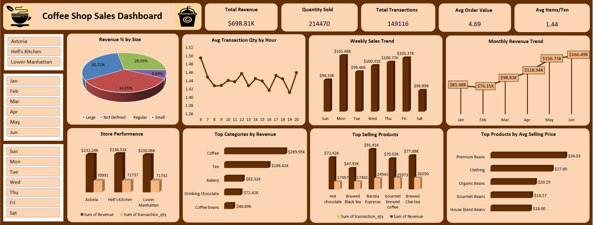

#  Coffee Shop Sales Analysis 

##  Project Overview

This project analyzes coffee shop sales data to uncover insights into revenue trends, customer purchasing patterns, product performance, and store-level performance. The dashboard helps identify key business drivers and opportunities to improve sales.

##  Problem Statement

The objective of this project is to analyze coffee shop sales data and identify trends in revenue, customer purchases, product demand, and store performance to support better business decisions.

##  Tools Used

- Python – Data Cleaning & Data Preprocessing
- Excel – Dashboard Creation & Data Visualization
- Power Query – Data Transformation

##  Dataset Source

Dataset obtained from Kaggle for coffee shop sales analysis.

## Dataset Columns

- Transaction ID
- Transaction Date
- Transaction Time
- Transaction Quantity
- Store ID
- Store Location
- Product ID
- Unit Price
- Product Category
- Product Type
- Product Detail
- Size
- Revenue
- Month Num
- Month Name
- Week Day
- Week Num
- Hour

---

##  Key Performance Indicators (KPIs)

- Total Revenue
- Quantity Sold
- Total Transactions
- Average Order Value (AOV)
- Average Items per Transaction

---

##  Dashboard Screenshots

## 📊 Excel Dashboard Workbook

[Download Excel-Dashboard-Workbook](Excel-Dashboard-Workbook/Coffee-Shop-Sales.xlsx)

##  Python Colab File
https://colab.research.google.com/drive/1CNtPWSrtsA659xlZTcXCqnyBV490wQUk?usp=sharing

##  Key Insights

- Coffee was the highest revenue-generating category.
- Brewed Chai Tea recorded the highest quantity sold.
- Barista Espresso generated the highest revenue.
- Hell's Kitchen recorded the highest revenue among stores.
- Lower Manhattan achieved the highest quantity sold.
- Large-sized beverages contributed the highest revenue share.
- Revenue peaked in June.

##  Conclusion

The analysis highlights key revenue-driving products, categories, and store locations. Revenue can be further improved through targeted promotions, combo offers, and cross-selling strategies.
